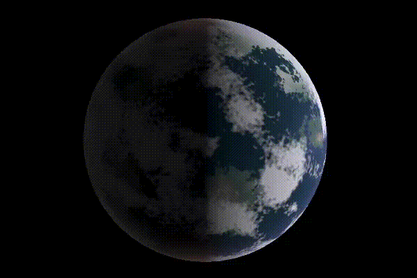
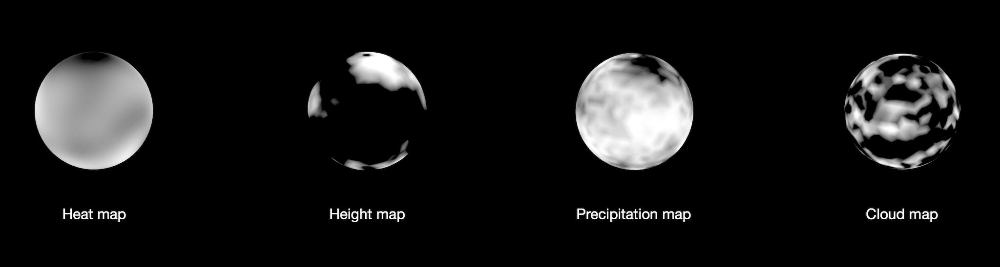

# planets on wgpu
by James Youngblood

This is a project built for my Interactive Graphics course at the University of
Utah. It procedurally generates and renders an earth-like planet.

The planet is generated by using 3D simplex noise to create maps for heat,
precipitation, height, and clouds on the surface of the sphere. Surface color
will be blended based on these map values for every point on the sphere.

The project is deployed on the web! View it
[here](https://soundeffects.github.io/planets_on_wgpu). It can also be run
locally. Download the repository and use `cargo run`.

# Credits
Most of my time building this project was spent learning how to use
[wgpu](https://wgpu.rs). To this end,
[Learn WGPU](https://sotrh.github.io/learn-wgpu) was a huge help and much
appreciated. The [hexasphere](crates.io/crates/hexasphere) and
[bevy_shader_utils](https://docs.rs/crate/bevy_shader_utils) crates were also
helpful for my implementation--thanks to them as well.

This code is released under both the Apache-2.0 and the MIT license. Both can be
found under the `docs/` directory. Feel free to use the code under whichever
license you prefer.